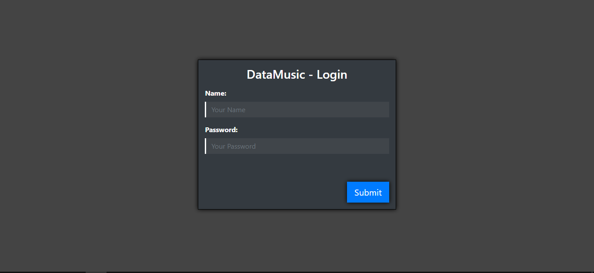
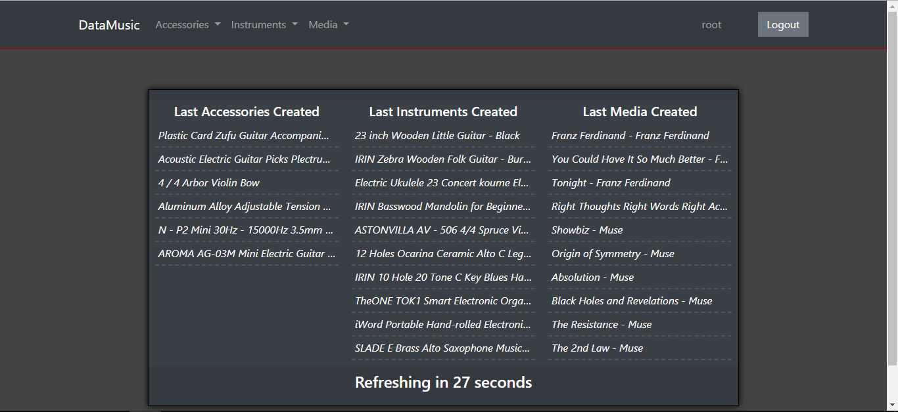
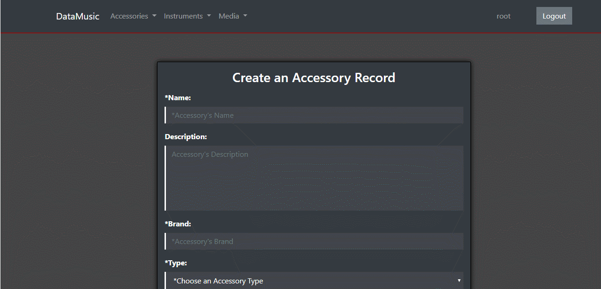
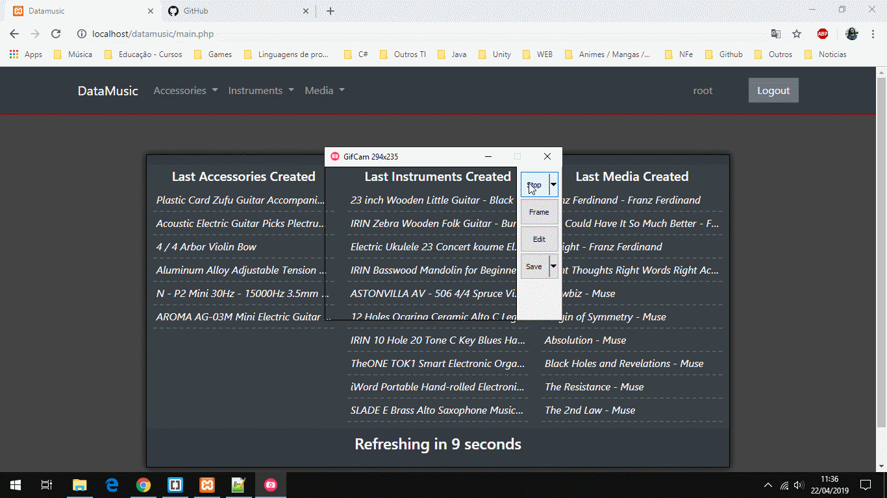

# datamusic-php-sample | English - [Português](README-pt.md)
Project made with object to simulate an stock of a musical store.
I used [PHP](https://www.php.net/) for the backend,
[Bootstrap](https://getbootstrap.com/) and
[jQuery](https://jquery.com/) for the frontend.
To do a local deploy, you need to have XAMPP (with MySQL) installed, put the folder "datamusic" 
inside the "htdocs" in XAMPP installed folder, set up some configuration in the file "connection.php" and execute the sql files
from the folder "sql" in your database.

Some screenshots:

